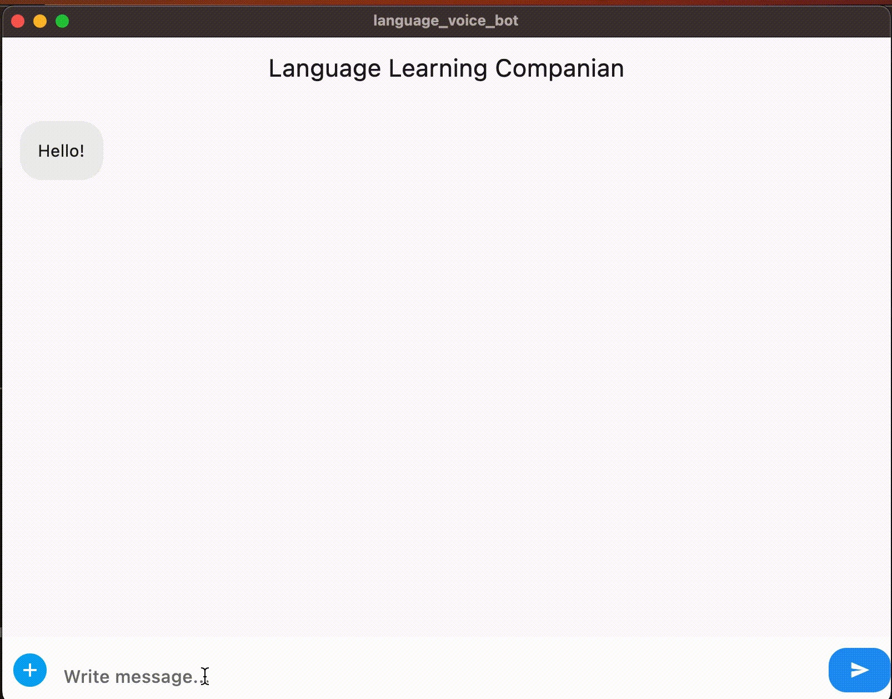

# LanguageLearningBot
This is an application which provides an interface for user to chat or converse through voice with a bot for learning any new language.

## Current State

* User Responses are being updated on the UI

## Next Steps

* Get texts back from the AI model
* Implement a scenario where user and companion is sitting in a restaurant 

