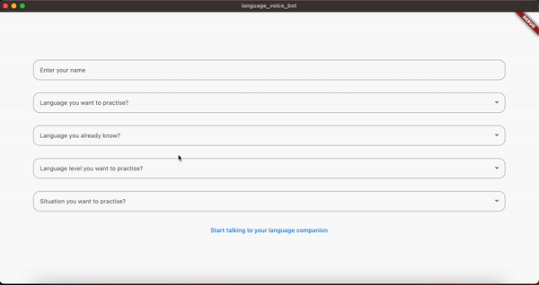

# LanguageLearningBot
This is an application which provides an interface for user to chat or converse through voice with a bot for learning any new language.

## Problem I'm solving 
From the past 1 year, I started developing a passion for learning new languages. I've started learning Spanish but even with 240 days of streak on Duolingo, I'm not able to clearly understand when I talk to a native Spanish speaker. I'm building an AI voice bot which would talk with me in different languages given a particular scenario(like we are in restaurants etc.) and level of language expertise I want to practise.

## Current State

* With system settings of begineer level of Spanish and user is talking to spaker in a restaurant, assistant is responsing back. 

## Next Steps
* Give possible response to user to respond with in the next message(so conversation don't die)
* Enhance translation from language user learning to language user know so that they can learn new words
* Deploy server(app.py) to lambda instead of running using flask in a local server
* Ultimate: Make assistant speak and user record their voice to move to spoken based learning

## Flutter Important Resources

* [Simple app state management](https://docs.flutter.dev/data-and-backend/state-mgmt/simple)
* [Promises in flutter](https://docs.flutter.dev/cookbook/networking/send-data)